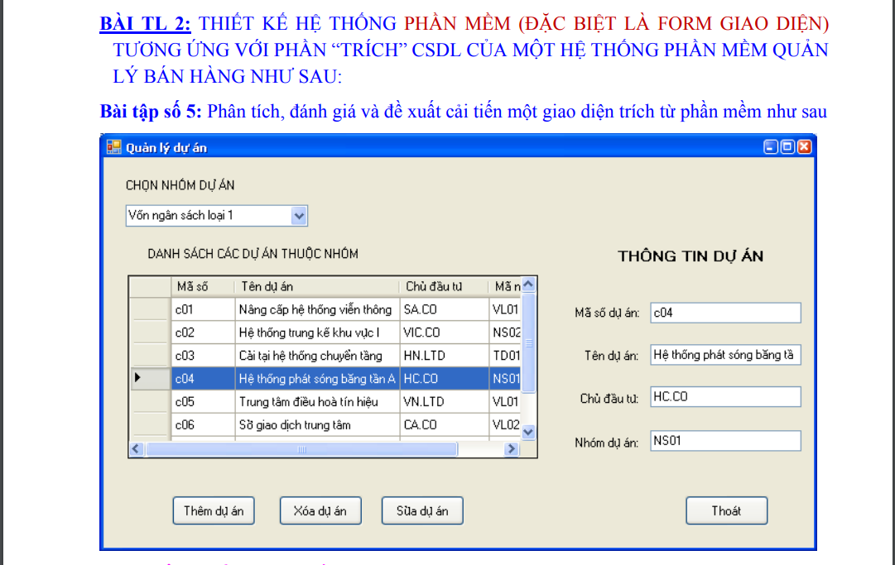
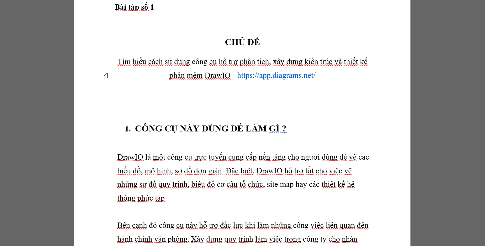
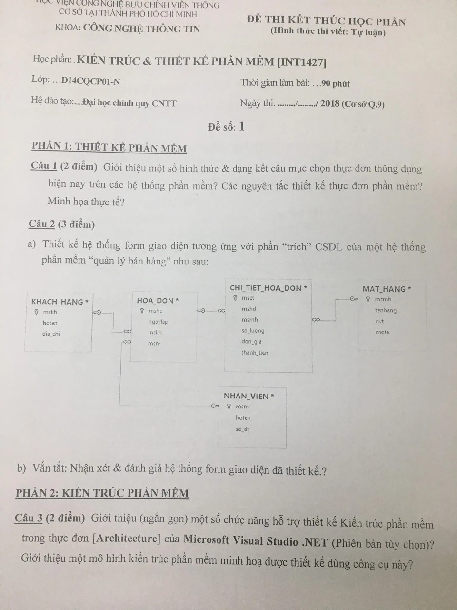
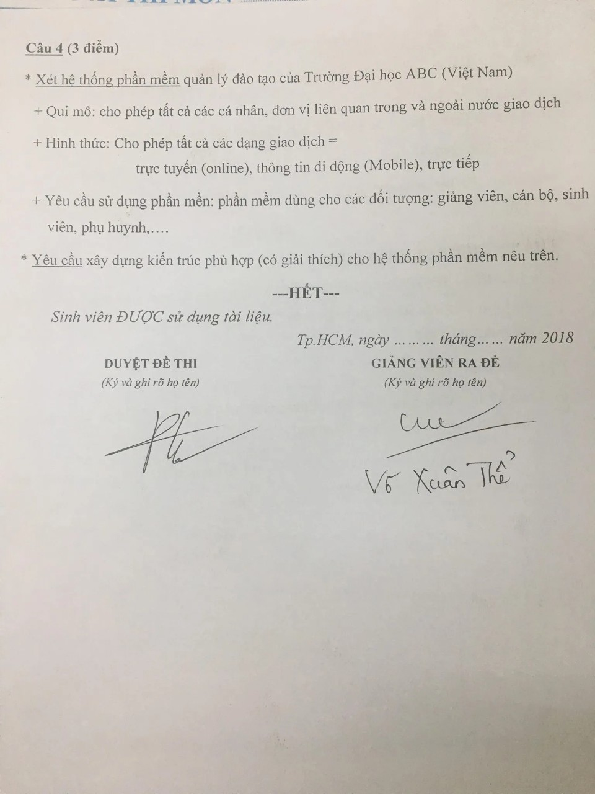
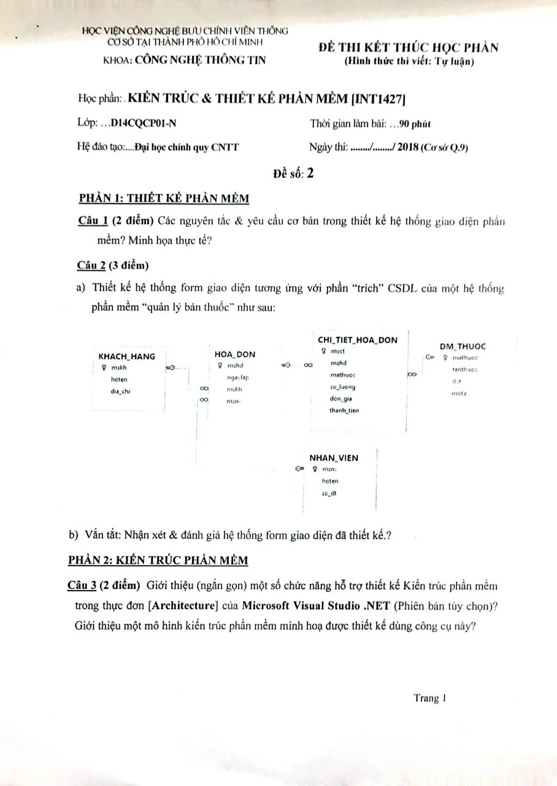
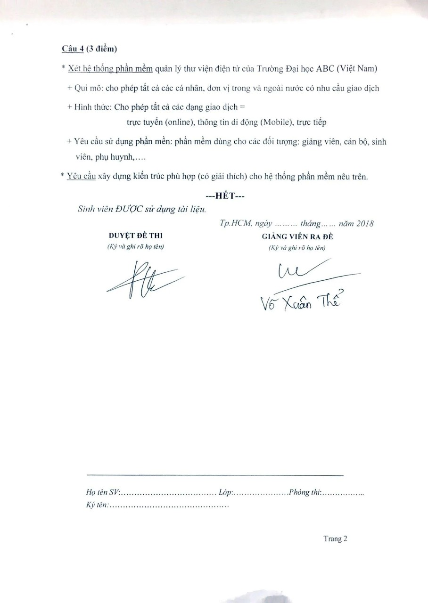

<h1 align="center">Kiến trúc và thiết kế phần mềm 
    Môn học dễ "thở" nhất do thầy Võ Xuân Thể giảng dạy
</h1>

    

# [**Table Of Content**](#table-of-content)
- [**Table Of Content**](#table-of-content)
- [**Introduction**](#introduction)
- [**Overview**](#overview)
- [**Content**](#content)
- [**Official Exam**](#official-exam)
- [**Document**](#document)
- [**Post Script**](#post-script)
- [**Our Team**](#our-team)
- [**Made with 💘 and Vietnamese **](#made-with--and-vietnamese-)

# [**Introduction**](#introduction)
Tự dưng thấy có cái repository môn **Kiến trúc và thiết kế phần mềm** chắc các bạn sẽ hơi bị hoang mang các kiểu đúng hem 😂😂😂. Đừng lo, đừng lo. Đây chỉ đơn thuần là một bài viết cá nhân của mình để chi sẽ tất tần tật, tuốt tuồn tuột những gì bạn cần biết trước khi học môn học *easy* nhất thời sinh viên của bạn mà thoy.

Mình sẽ viết ngắn gọn, súc tích nhất có thể về môn học này, kèm theo các tài liệu mà mình tích góp, thu lượm và cả tự làm của mình với môn này. Nên đọc xong bài viết này đảm bảo là bạn sẽ biết từ đầu tới cuối nội dung học môn này lun.

Okay, Freund, auf geht's 💥(Alright, fields, let us go)

# [**Overview**](#overview)

Môn học này đầy đủ là Kiến trúc & thiết kế phần mềm. Môn học này là một môn 3 tín chỉ, các bạn sẽ học tổng cộng 11 buổi và là môn học lý thuyết nên thi cuối kì là thi tự luận, **không phải làm đồ án đâu nha**.

Môn này thì thầy Thể cũng rất là dễ & vui tính nữa. Thi thoảng thầy kể những câu chuyện rất hài hước nên đây là môn học mà cá nhân mình thấy rất thích.

Thầy cũng nói ngay tại buổi học đầu rằng: "Tui là tui muốn tạo điều kiện cho các học sinh của tui khi ra trường sẽ không thiệt thòi so với những sinh viên trường khác. Nhưng các bạn hãy luôn nhớ rằng, có thể ở trường thầy trò chúng ta học và chấm bài có thể được 10 điểm nhưng 
không bao giờ được tự mãn các bạn nhé😅. Mà chúng ta phải biết bản thân mình tới đâu và không ngừng nỗ lực học tập vươn lên. Còn chuyện điểm số thì các bạn không phải lo lắng nhé. Cứ học và làm đúng yêu cầu tui đưa ra là ok hết 😍😍😍. Nói chung là không phải lo lắng chuyện điểm số đâu nha"

Thầy nói như trên là các bạn có thể yên tâm rùi nha. Nói chung là nghe tới đoạn này là thấy khỏe re ròy😛😛

# [**Content**](#subjects-content)

11 buổi (2 tháng 3 tuần) học các bạn sẽ có 11 bài kiểm tra 10 phút mỗi cuối buổi. Ui cha, sao lại bài kiểm tra nhỉ 🥴🥴 ? 
Đừng lo, nói là bài kiểm tra nhưng thực chất là thầy đọc cho chúng ta chép vào tờ giấy đó rùi nộp lại cho thầy. Đây là cách điểm danh sinh viên của thầy á. 

Lưu ý, các bạn hãy đi đủ và chép đầy đủ những đầy đủ những gì thầy đọc vào tờ giấy. Sau này, thầy có thể tra lại cho chúng ta để làm đề cương ôn tập. 
Do thời gian kết thúc môn sẽ khoảng tháng 3 - đầu tháng 4 nhưng các bạn sẽ thi vào tầm tháng 6( như mình là ngày 23-06-2022 nè), lúc này 96,69% bạn đã quên sạch sành sanh rùi.

Tiếp theo là kiểm tra giữa kì, à làm gì có kiểm tra giữa kì đâu nhỉ 🙄🙄. Thay vào đó bạn sẽ phải làm 2 bài tập **BẮT BUỘC** để nộp cho thầy.

- Bài tập bắt buộc số 1 - thầy sẽ cho các bạn một cái giao diện, hãy phân tích - đánh giá - đề xuất cải tiến cái giao diện này.

    

<h3 align="center">

***Đề bài bài tập bắt buộc số 1***
</h3>

- Bài tập bắt buộc số 2 - thầy yêu cầu các bạn trình bày cách sử dụng chức năng Architecture của Visual Studio hoặc một công cụ tương đương(thường thì sinh viên chọn mô tả DrawIO)

    

<h3 align="center">

***Phần mở đầu bài làm của mình nè😎***
</h3>

>Note: hãy làm thật cẩn thận 2 bài tập bắt buộc này vì 2 bài này sẽ 100% xuất hiện trong bài thi cuối kì của bạn !

Cuối cùng, bài kiểm tra cuối kì 🥱. Thầy Thể sẽ nói luôn ngay tại buổi học đầu tiên nội dung ra đề cuối kì của thầy luôn nhé. Tóm tắt như mô tả dưới dây:

Bài thi sẽ có 2 phần: 

[**1. Kiến trúc phần mềm**](#)

Câu hỏi 1: sẽ ra 1 trong 2 dạng

- Dạng 1: Thiết kề form giao diện dựa theo một cơ sở dữ liệu cho trước

- Dạng 2: Phân tích, đánh giá và đề xuất cải tiến một phần “trích” cơ sở dữ liệu.

Câu hỏi 2: Một câu hỏi lý thuyết trong số 35 câu hỏi thầy Thể đọc cho các bạn chép trong 11 buổi học

[**2. Thiết kế phần mềm**](#)

Câu 1: yêu cầu mô tả giới hạn, vẽ kiến trúc minh họa cho hệ thống

- Thư viện thông minh

- Quản lý đào tạo đại học

Câu 2: Nêu vắn tắt cách sử dụng chức năng Architecture của Visual Studio hoặc một phần mềm tương đương. Ví dụ minh họa cách vẽ một kiến trúc trên phần mềm này.

Các bạn có thể vào [**đây**](https://youtu.be/lFXuHtYpKZ8?t=4199) để xem buổi học cuối thầy Thể dặn dò những gì nhé 🔆

# [**Official Exam**](#official-exam)

Đề thi chính thức của mình như sau: 

Câu 1:

    Giới thiệu một số hình thức và dạng kết cấu mục chọn thực đơn thông dụng hiện nay trong các hệ thống phần mềm? Các Nguyên tắc thiết kế thực đơn phần mềm? Minh họa thực tế?

Câu 2:

    Hãy phân tích, nhận xét, đề xuất cải tiền dựa theo phần "trích" cơ sở dữ liệu dưới đây.(Mình quên chụp hình òy 😪)

Câu 3:

    Giới thiệu vắn tắt cách sử dụng chức năng **Architecture** trong Visual Studio hoặc một phần mềm tương tự. Yêu cầu ví dụ minh họa cách vẽ một kiến trúc trên mô hình này.

Câu 4: 

    Xét hệ thống quản lý thư viện thông minh của trường đại học XYZ. Yêu cầu mô tả giới hạn và mô hình kiến trúc phù hợp kèm giải thích cho hệ thống nêu trên.

Phía trên là toàn bộ đề thi của khóa D18 tụi mình, một số đề thi chính thức mình lụm được trên từ các anh chị khóa trước của Phong nè

    

    

<h3 align="center">

***Đề thi thứ nhất😎***
</h3>

    

    

<h3 align="center">

***Đề thi thứ hai😎***
</h3>

# [**Document**](#document)

Khi tải repository này về các bạn sẽ có:

- Hai bài tập bắt buộc của thầy, gồm đề bài & phần bài làm của mình để tham khảo trước.

- Hai đề thi phía trên(dĩ nhiên rùi 😛)

- Bộ 35 câu hỏi đã được biên soạn kĩ càng để chỉ việc in ra và mang vào phòng thi chép.

- Các tài liệu nội dung môn học của thầy Thể cấp cho tụi mình.

# [**Post Script**](#post-script)

Nếu các bạn thấy bài viết này có giá trị, hãy tặng mình một ⭐ nhé. 

**Sunday, 26-06-2022**

Đây là những di sản cuối cùng mà Phong có thể xây dựng và để lại cho các bạn. Tuy những nội dung này không có gì cao siêu và các bạn cũng sẽ trải qua khi học môn này. Tuy nhiên, đây là những tâm huyết mình hội tụ lại sau khi chuẩn bị nói lời "tạm biệt" với mái trường 4 năm rưỡi mình đang theo học. Phong hi vọng tất 
cả các bạn đang đọc những dòng lưu bút này của Phong sẽ gặp nhiều may mắn trong học tập và công việc sau này.

Một lần nữa, cảm ơn các bạn vì đã ở đây🤗🤗

# [**Our Team**](#our-team)

<table>
        <tr>
            <td align="center">
                <a href="https://github.com/Hareki">
                    
                     
                    <b>Nguyễn Ngọc Minh Tú</b>
                </a>
            </td>
</table>

Phần này, mình muốn gửi lời tri ân sâu sắc tới bạn **Nguyễn Ngọc Minh Tú**. Nếu không có bạn Tú giúp đỡ chia sẻ bộ 35 câu hỏi đã được biên soạn lại thì mình cũng khó mà làm được câu hỏi trong đề thi(do tài liệu gốc của thầy quất `teen code` quá khủng khiếp😅😅. Đọc xong lú cmn đầu lun).

Thêm việc phải vừa học, vừa thực tập khiến mình cảm thấy rất mỏi mệt, học khó vào & không có thời gian để biên soạn lại 35 câu hỏi này.

Nếu Minh Tú có đọc được những dòng này, Phong muốn nói với bạn rằng Phong rất biết ơn sự giúp đỡ của bạn. Cảm ơn Tú rât nhiều ❤❤
 
# [**Made with 💘 and Vietnamese **](#made-with--and-vietnamese)